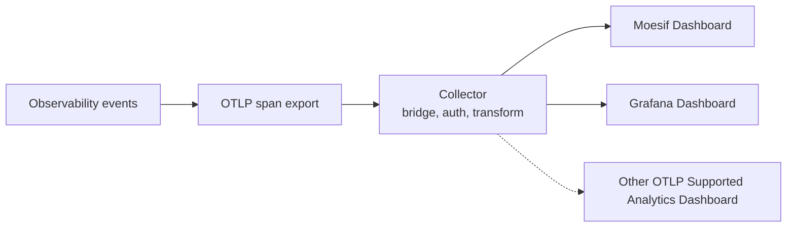

# Analytics for agent identities

- **Status:** Draft
- **Version:** 1.0
- **Related documents:** [Discussion #5359: Analytics for agent identities](https://github.com/thunder-id/thunderid/discussions/5359), Issue #5322, [PR #4931: Principal and correlation context on observability events](https://github.com/thunder-id/thunderid/pull/4931)

## Summary

An administrator running agent identities cannot see what those agents are doing. ThunderID publishes a structured event for every token issuance and flow step, these events carry the principal and delegation context that makes per-agent attribution possible, but nothing turns that stream into an answer. Reaching a number today means discovering the schema, choosing a pipeline, and writing every query by hand.

Agent analytics defines what the published events mean in business terms, the derivations that turn them into the numbers an administrator acts on, and the transformations needed before those numbers can be charted at all. ThunderID ships a dashboard definition for each supported rendering product and the documentation to rebuild it anywhere else. It ships no analytics runtime: no query engine, no time-series store, no charting service, and no new API.

The governing design decision is that **ThunderID owns the meaning and the operator owns the machinery**. ThunderID defines which fields carry which business signal, what each panel asks, and what each answer may not be read to mean. The operator owns the shipper, the store, and the rendering tool. Every existing seam is reused unchanged: the observability event pipeline, its category filtering, and the principal fields #4931 added. This specification changes no production code.

Delivery is over **OpenTelemetry**, which both supported products read. One pipeline feeds both: ThunderID exports OTLP, a collector reshapes two fields and routes to the product. The file sink remains available for a store that ingests log files rather than OTLP, but no shipped dashboard definition reads it and it is out of scope here.

## Architecture

Responsibilities:

- **Event emission** is ThunderID's. It publishes one event per token issuance and flow step, carrying the acting principal, the subject, the delegation indicator, the grant, the outcome, and the duration. Nothing is added to the request path and no port is opened.
- **The OpenTelemetry export** is how events leave ThunderID for both supported products. Completeness is bounded by the sink's configured categories. Token issuance events are published under `observability.authentication` and flow events under `observability.flows`, so a sink configured for flows alone publishes nothing any panel reads. A sink with no category list configured admits every category. The export is live only: spans emitted while the collector is down are lost, with no replay.
- **The collector** is the operator's, and on the OpenTelemetry path it is not optional. ThunderID exports OTLP over gRPC only and cannot attach an authentication header, so a product requiring OTLP over HTTP with an API key is unreachable without one. The collector also performs the field transformations below, without which three panels cannot be built.
- **The store and the rendering tool** are the operator's entirely. ThunderID makes no assumption about what they are beyond the shape of the events it publishes.

## Detailed design

### From events to answers

Each business question is answered from one filtered event stream, by a defined reduction over it or, for the detail panel, by the matching events themselves. There is no derived state, no join, and nothing retained between queries.

Eleven published fields carry the meaning the feature depends on:

| Field | Business meaning |
|---|---|
| `data.act_type` | Separates automated work from human sign-ins and ordinary application traffic |
| `data.client_id` | Names the agent in terms a person recognizes, rather than by opaque identifier |
| `timestamp` | When the operation happened, which buckets every trend and orders the detail panel |
| `component` | Which subsystem emitted the event, which separates token issuance from flow execution |
| `status` | Whether the work succeeded, which drives every health number |
| `data.is_delegated` | Whether the agent acted for a person rather than as itself |
| `data.grant_type` | How the agent obtained access, and the only field separating a consented sign-in from a token exchange |
| `data.sub` | Whose data the agent was authorized to reach |
| `data.duration_ms` | How long the agent waited for access, as an early signal of degradation |
| `data.error.message` | What is actually broken, in words rather than a status code |
| `data.correlation_id` | Joins every event of one authentication, so a chart can lead to the events behind it |

The derivations:

| Question | Derivation |
|---|---|
| How much work did agents do, and how much failed? | Count of issuances that reached success or failure, split by outcome |
| Is workload rising, falling, or spiking? | The same count, as a trend over time |
| Which agents carry the load? | Successful issuances grouped by `data.client_id`, top N |
| How much is done for a person, and for whom? | Successful issuances split by `data.is_delegated`, with the delegated ones grouped by `data.sub` |
| How do agents obtain access? | Successful issuances grouped by `data.grant_type` |
| What is failing, and why? | Failed issuances grouped by `data.error.message` |
| Are agents kept waiting? | Percentiles of `data.duration_ms` over successful issuances |
| What happened behind a number? | The matching events themselves, most recent first, joined to a chart by `data.correlation_id` |

### Attributing activity to an agent

Every token panel filters on three conditions together. This is the most consequential rule in the design, because omitting any of them produces a plausible number rather than a visible failure.

| Condition | Excludes |
|---|---|
| `act_type = agent` | Human sign-ins and ordinary application traffic |
| `component = AuthHandler` | Flow execution events, the same agent performing a different activity |
| `status` is `success` or `failure` | The `in_progress` half of each issuance |

Attribution must never rest on `sub_type`. A failed issuance carries `act_type` and `client_id` but no subject, because the failure can precede subject resolution, so a `sub_type` filter looks correct and silently discards every failure.

### Making published fields usable

Three fields cannot be charted in the form ThunderID emits them. The collector transforms them, because the product indexes what it receives. Without this, three panels render nothing and report no error.

| Field | As published | Required transformation |
|---|---|---|
| `data.is_delegated` | Boolean, which no supported product groups on cleanly | Publish the reader-facing wording as a string |
| `data.error` | Object, serialized to one opaque value on the OTLP path | Split into code, type, and message |
| `data.duration_ms` | String, which no store aggregates as published | Publish an integer copy |
| `data.sub` | Opaque resource ID | Map onto the product's own subject field |

The delegation indicator is the only boolean in the payload, and every consumer has needed its own workaround: a store that builds keyword subfields creates none for a boolean, so grouping silently returns nothing, and a trace store renders the series as `true` and `false`. Publishing a string at the source would remove the transformation entirely.

Duration carries a constraint of its own. The numeric type matters: an integer copy aggregates, while a floating point copy is a valid numeric attribute that the trace store's percentile and histogram functions silently return no series over. Publishing the value as a number rather than a string would remove this transformation too.

`data.error` carries a second constraint into the transformation, because the message sits at a different path in each event family. Token events hold a flat string at `data.error.message`. Flow events hold a localizable object there instead, whose readable text is at `data.error.message.defaultValue`. No single source path serves both, so the rule reads the flat string where the message is a string and the default value otherwise, resolving both families to the one scalar message the failure panel groups on.

### Panels

Each panel states the question it answers and the decision it supports. Titles and descriptions address the administrator who owns the outcome, not the engineer who knows the schema.

| Panel                       | Question it answers | Decision it supports |
|-----------------------------|---|---|
| Agent activity              | How much work did agents do, and how much failed? | Whether anything needs attention at all |
| Activity over time          | Is agent workload rising, falling, or spiking? | Capacity, and noticing an agent that has started misbehaving |
| Most Active agents          | Which agents carry the workload? | Which would hurt most if they broke, and where to look first |
| Delegated against direct    | How much was done on someone's behalf? | The consent and compliance exposure of the fleet |
| Work performed for a person | Whose work are agents doing? | Which people are most exposed if an agent is compromised |
| How agents obtain access    | Which mechanism does each agent use? | Whether agents are on the intended path |
| Top failure causes          | Why is agent work failing? | Whether a failure is misconfiguration or an agent defect |
| Response time               | How long are agents waiting? | Early warning that an agent or the deployment is degrading |
| Activity detail             | What happened behind that number? | Investigating a spike without leaving the dashboard |

**Activity detail** is not delivered on every product, because it needs a raw event list and a trace store does not provide one.

Agents are labelled by `client_id` and never by a resource identifier, which is opaque by design and renders as a list nobody can act on. A person has no equivalent in the event, so the subject of a delegated issuance is reported by its resource identifier: opaque, but stable and correlatable against the directory, which is what a reviewer asking on whose behalf actually needs. Resource identifiers remain available in the detail panel.

Every caveat travels in the description of the panel it qualifies rather than in a limitations section a reader may never reach, because a number a reviewer will act on must carry its own qualification.

### Coverage and limits

Stated as design output, because each is a question a reader would otherwise assume is answered.

**Only token activity is observable.** ThunderID publishes token issuance, revocation, a runtime database availability event, and flow execution events. There are no agent lifecycle events, no credential rotation events, and no event for an agent calling an API with a token it already holds.

**Rejected credentials are invisible.** A request that fails client authentication emits no event, so the failure count covers failures occurring after authentication and is not a measure of credential attacks.

**Latency comes from the published duration, never from span timing.** The operation's true duration is published as `data.duration_ms` and an integer copy of it charts correctly. The intrinsic span duration must not be substituted: it measures delivery and reads a fraction of the real value.

**Span timing on the OpenTelemetry path is not operation timing.** The subscriber starts each span at the event timestamp and ends it at the current clock, so span duration measures delivery latency. The start time is sound, so both paths expose when the operation happened: as the `timestamp` field on the event log and as the span start time under OpenTelemetry. Only the end time, and therefore the duration, is unusable. Nothing writes a parent reference, so no trace hierarchy exists. Latency on that path must come from the duration attribute. Correcting this is a change to the OTel subscriber, out of scope here, and would also fix the tracing backends the observability guide already documents.

## Requirements

### R1. Measuring agent activity from published events

**Requirement:** An administrator sees how much work agents are doing and how much is failing, without adding instrumentation to ThunderID.

**Acceptance criteria:**

- **AC1.1:** Given the observability output is enabled, when an agent obtains a token, then an event is published carrying the acting principal type, client identifier, outcome, grant type, and duration.
- **AC1.2:** Given the feature is adopted, then ThunderID exposes no new endpoint, opens no port, and adds no service.
- **AC1.3:** Given the feature is adopted, then no production code changes.

### R2. Attributing activity to the right agent

**Requirement:** Counts reflect the number of token issuances agents actually performed, so that an administrator is not misled by a plausible but wrong number.

**Acceptance criteria:**

- **AC2.1:** Given agent traffic, flow execution events, and non-agent traffic share one stream, when a token panel counts activity, then flow events and the in-progress half of each issuance are excluded.
- **AC2.2:** Given the guide describes any token panel, then it states all three attribution conditions together, because omitting one produces approximately double the real number rather than a failure.
- **AC2.3:** Given a token request fails after the client authenticates, when the failure is counted, then it is attributed to the correct agent even though the event carries no subject.

### R3. Identifying agents in recognizable terms

**Requirement:** An administrator can tell which agent a number refers to without resolving an identifier.

**Acceptance criteria:**

- **AC3.1:** Given several agents have traffic, when the most-active panel is read, then each agent is labelled by its client identifier.
- **AC3.2:** Given a panel shows an aggregate, when an administrator opens the detail view, then the underlying resource identifiers remain available for investigation.

### R4. Reviewing work performed on a person's behalf

**Requirement:** A security reviewer sees how much agent activity was performed on behalf of a person, and on whose behalf.

**Acceptance criteria:**

- **AC4.1:** Given a person signs in to an agent configured to record the acting party, when the issuance event is read, then it identifies the agent as actor and the person as subject.
- **AC4.2:** Given delegated and direct activity in the same window, when the delegation panel is read, then the two are separated.
- **AC4.3:** Given an agent reaches a person's access by token exchange rather than a sign-in, when the delegation panel is read, then it states that grant type is the only field distinguishing the two, so that consent is not inferred from delegation alone.
- **AC4.4:** Given delegated activity for several people in the same window, when the subject panel is read, then the activity is broken down by the person acted for, identified by entity resource ID.

### R5. Explaining failures in actionable terms

**Requirement:** An administrator sees why agent work is failing, in words rather than status codes.

**Acceptance criteria:**

- **AC5.1:** Given failed agent token requests, when the failure panel is read, then causes are grouped by the failure message rather than by status code.
- **AC5.2:** Given a request is rejected before the client authenticates, when the failure panel is read, then it states that such requests emit no event and are not counted.

### R6. Making published fields usable before they are charted

**Requirement:** The delegation, failure and latency panels work rather than silently rendering nothing.

**Acceptance criteria:**

- **AC6.1:** Given delegation is published as a boolean, when a delegation panel is built, then a string form of the value is available to group on.
- **AC6.4:** Given duration is published as a string, when a latency panel is built, then an integer form of the value is available to aggregate, and the intrinsic span duration is not used.
- **AC6.2:** Given the failure cause is published as a nested object, when a failure panel groups by cause, then the cause is a scalar value and not a serialized object.
- **AC6.3:** Given an event whose failure message is a localizable object, when the cause is read, then its default value is used.

### R7. Reaching the analytics product an organization already runs

**Requirement:** An organization sends ThunderID events to its existing analytics product without modifying ThunderID.

**Acceptance criteria:**

- **AC7.1:** Given a product that ingests OpenTelemetry, when the OpenTelemetry output is enabled for `observability.authentication`, for `observability.all`, or with no category list configured, then every token event a panel reads is exported.
- **AC7.2:** Given a product that ingests OpenTelemetry over HTTP and authenticates with an API key, when a collector is placed between it and ThunderID, then events are delivered and the collector supplies the protocol bridge and the header.
- **AC7.3:** Given events are delivered over OpenTelemetry, then the guide states that span timing measures delivery rather than the operation, and directs latency panels to the duration attribute.

### R8. Rebuilding the analysis in an unsupported product

**Requirement:** An operator using a product ThunderID ships no definition for can rebuild every panel from the documentation.

**Acceptance criteria:**

- **AC8.1:** Given the guide, when an operator reads any panel, then its question, source fields, attribution conditions, and derivation are stated in product-neutral terms.
- **AC8.2:** Given the guide, then it states which products have a shipped dashboard definition, and that a definition is specific to the product that renders it.

### R9. Identifying dormant agents (out of scope)

**Requirement:** An administrator can see which agents have stopped working, so that unused agent identities can be retired.

Not covered by this specification. An absence of events is not an event, so the published stream cannot distinguish an agent that stopped from one that never existed. Answering it requires joining the agent inventory from the management API, which is a second datasource and a separate decision. Tracked in Issue #4751.

### R10. Analytics inside the Console (out of scope)

**Requirement:** An administrator sees agent analytics without leaving ThunderID.

Not covered by this specification. Serving it would require a query engine, a time-series store, a charting layer, and a reporting API inside the runtime, which is opposed to the governing decision in Summary. Tracked in Issue #4751.

## Change log

| Version | Date | Change |
|---------|---|---|
| 0.1     | 2026-09-11 | Initial specification. |
| 0.2     | 2026-09-14 | Added the OpenTelemetry delivery path and its collector boundary. Corrected agent attribution to require three conditions. Added the transformations required before latency and failure panels can be built. Corrected the on-behalf-of mechanism to an authorization code flow with the actor claim. Recorded span timing and trace hierarchy as unusable on the OpenTelemetry path. |
| 0.3     | 2026-09-14 | Restructured to match the house specification style. Requirements rewritten as capability statements with Given/When/Then acceptance criteria, out-of-scope items recorded as numbered requirements, and open questions removed. |
| 0.4     | 2026-09-22 | Narrowed delivery to the OpenTelemetry export, which both supported products read; the event log remains available but no shipped definition reads it. Replaced the Grafana reference from a log store to a trace store. Dropped the latency panel and recorded why it cannot be charted on that path. Replaced the duration transformation with the delegation one, the boolean being what no supported product groups on. |
| 0.5     | 2026-09-24 | Removed the observability file sink's configuration surface from scope. The shipped dashboards read the OpenTelemetry export, so bounding the log is no longer part of this feature and this specification changes no production code. |
| 1.0     | 2026-09-24 | Corrected the latency finding. An integer copy of the published duration aggregates correctly, so the latency panel is delivered after all. The earlier claim that only the intrinsic span duration aggregates was drawn from testing a floating point copy, which is the one numeric type the percentile and histogram functions do not accept. |
