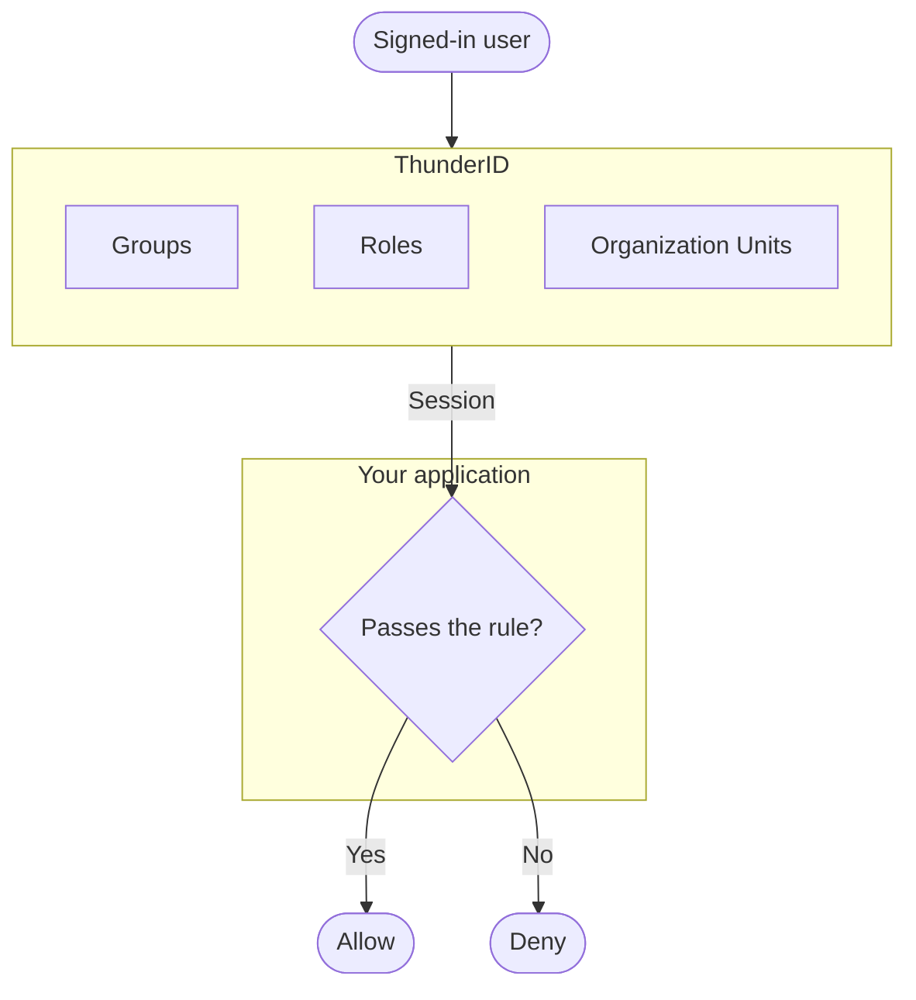

# Restrict Access Within an Application

## Problem

Not every signed-in user should be able to do the same things inside an application.

For example, a finance tool used by the whole company may hold submitted expense reports, approval history, and reimbursement data that only the finance team should see. The application already knows who is signed in, but it still has to decide what that person is allowed to do next.

Without that check, every signed-in user looks the same to the application. An engineer and a finance manager can reach the exact same pages and data, even though only one of them should be able to.

You need a way to decide, for each signed-in user, what parts of the application they can see or do.

## Stakeholders

Deciding what a signed-in user can do usually involves three groups.

* **Application owners or administrators** decide which parts of the application different users should be allowed to see or do.
* **Identity administrators** organize users into the groups, roles, or organizational structures those decisions depend on.
* **Application users** see and use only the parts of the application their access allows.

Together, these stakeholders define what different users should be allowed to do, structure the information that backs those decisions, and enforce them consistently across the application.

## Solution

Knowing who someone is does not say what they should be allowed to do. A signed-in engineer and a signed-in finance manager both come back from authentication with the same thing: proof of who they are, nothing more.

Telling them apart takes a second check. The application looks up something about the signed-in user, such as the group they belong to, the role they hold, or their place in the organization, and compares it against a rule for the page or action being requested.

That rule needs to point at something that stays current on its own. People join teams, change roles, and move between departments, so the application needs a structure it can check against, not a list an administrator edits by hand every time someone's job changes.

With that structure in place, a finance clerk and a finance manager can both be signed in and both pass authentication, while only one of them passes the rule for approving a report.

## How <ProductName /> solves it

Once your application knows who a signed-in user is (see [Restrict Access to an Application](../secure-my-new-application) if it does not yet), <ProductName /> can also tell it what that user belongs to. Groups, roles, and organizational structure come back alongside the session, so your application does not need to maintain a separate list of who belongs to what.

Your application checks that information against its own rule for the specific page or action being requested, and allows or denies accordingly. When someone changes teams or roles, <ProductName /> reflects the change immediately, so every application checking against it sees the same, current answer.

See [Groups](../../guides/users/manage-groups), [Roles](../../guides/users/manage-roles), and [Organization Units](../../guides/organization-units) to model the structure your rules depend on, and [Protecting Routes](/sdks-and-tools/node/guides/protecting-routes) to enforce them in your application.

## As your access requirements grow

Groups, roles, and organization units cover a lot, but not everything.

* **Different customer organizations need to stay separate, not just internal departments.** Organization units can model a single company's structure, but a SaaS product usually needs to isolate each customer's users, data, and configuration from every other customer's. See [Multi-Tenant SaaS Identity (B2B)](../b2b/multi-tenant-saas).
* **APIs need to enforce the same rules, not just the frontend.** A page can hide a button, but the API behind it has to reject the request independently, or the rule is not actually enforced. See [Manage Resource Servers](../../guides/resource-servers).
